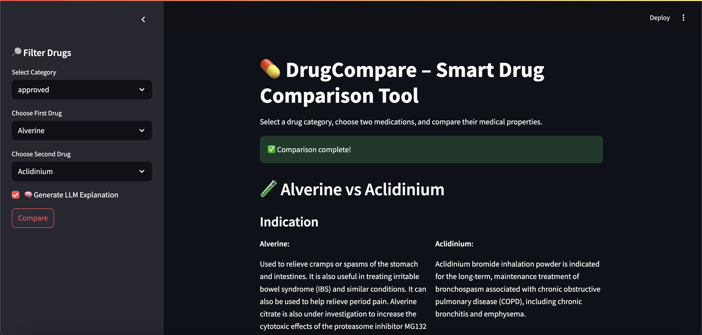
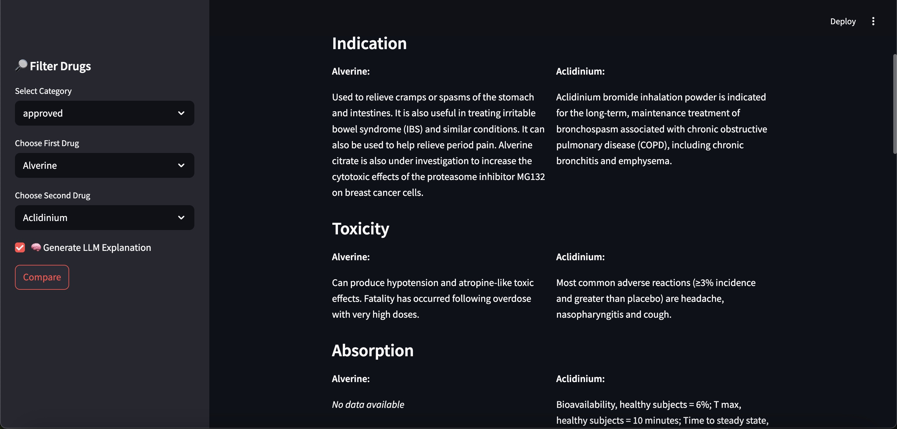
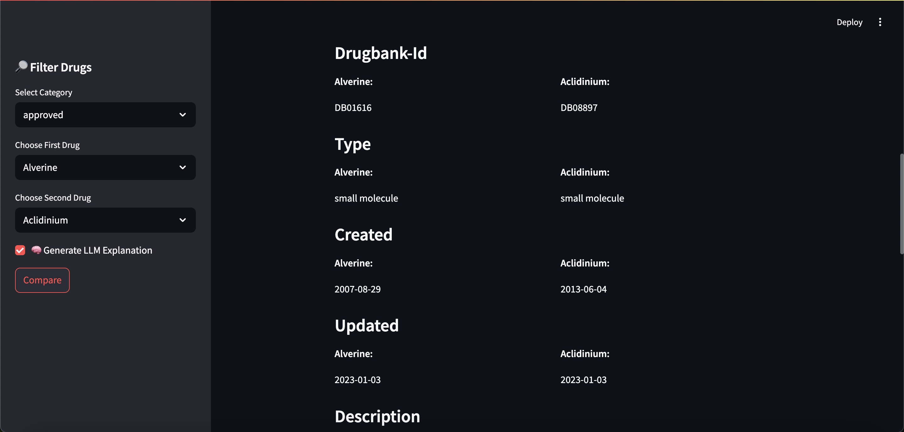
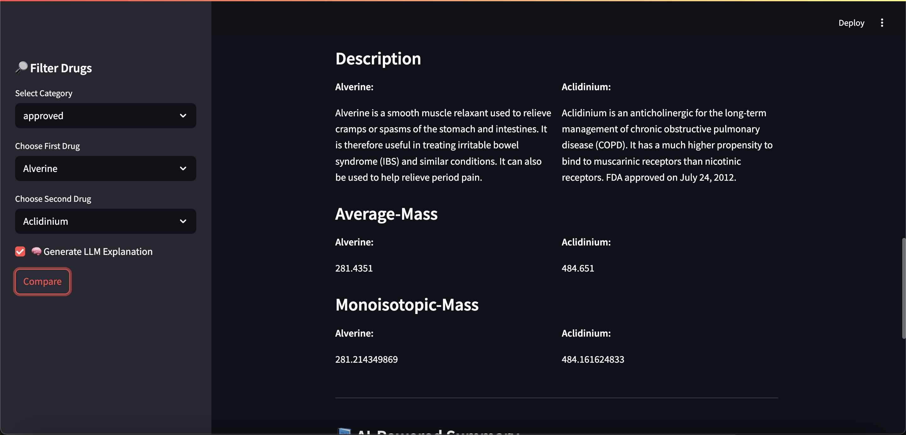
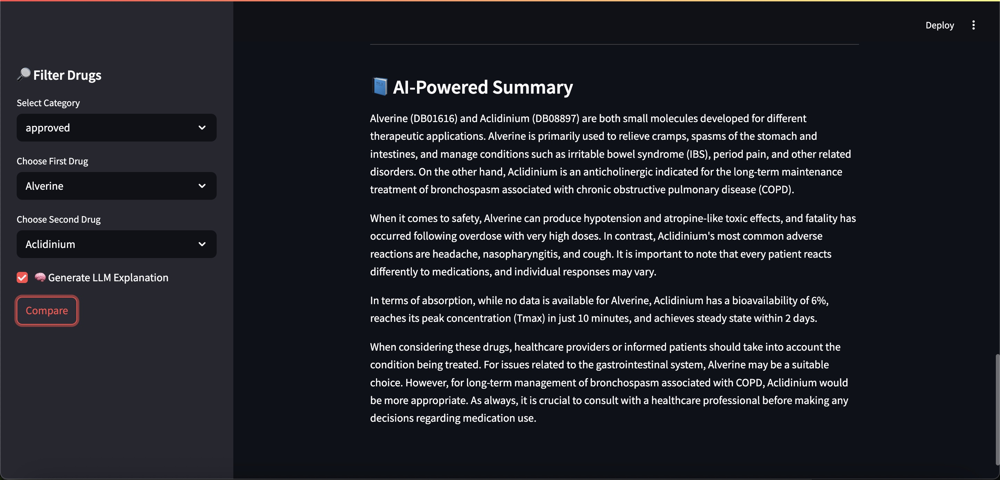

# 💊 DrugCompare – Smart Drug Comparison Tool

DrugCompare is a Streamlit-based application designed to intelligently compare medications based on real-world data from DrugBank. Users can filter by drug category, select two drugs, and compare their clinical attributes, side effects, and pharmacological details.

---

## 🚀 Features

- **Drug Category Filtering**: Choose from over 40 drug categories (approved, investigational, withdrawn, etc.).
- **Side-by-Side Drug Comparison**: See differences in indications, toxicity, absorption, and more.
- **📘 AI-Powered Explanation (via Ollama)**: Local LLM generates a medical summary comparing both drugs.
- **Smart Field Selection**: Only shows fields with the most populated data across DrugBank entries.

---

## 📷 Screenshots

### 🧾 Step 1: Select drugs and run comparison


### 🔍 Step 2: Comparison of drug fields




### 🤖 Step 3: AI-generated comparison summary


---

## 🧠 Powered by

- Streamlit
- Pandas
- Ollama (Mistral)
- DrugBank dataset (cleaned)

---

## 📦 Installation

```bash
git clone https://github.com/yourusername/drugcompare.git
cd drugcompare
pip install -r requirements.txt
streamlit run app/main.py
```

Make sure Ollama is installed and running locally (`ollama serve`), with the `mistral` model pulled via:

```bash
ollama pull mistral
```

---

## 🧪 Example Use Case

Compare two anticoagulants like **Warfarin** vs **Heparin**, and get a clear summary of:

- Mechanism of action
- Toxicity profile
- Route of elimination
- Interactions with food or drugs
- An AI summary on which might be more suitable based on purpose

---

## 📁 Project Structure

```
app/
├── data/
│   └── drugbank_clean.csv.zip
├── model/
│   ├── compare.py
│   ├── drug_processor.py
│   └── explain.py
├── docs/
│   └── image1.png ... image5.png
└── main.py
```

---

## 📄 License

MIT License. Drug data based on publicly available sources for educational purposes.

---

## 👨‍⚕️ Built for AI in Healthcare Portfolios
This project is designed to showcase smart, explainable, and ML-backed drug comparison interfaces for medical tech applications. Not for production use. Built for learning.
